# enPiT2019
2019年度第1回演習用のリポジトリです。

## GitHub演習

### 1. 課題提出用リポジトリの作成
1. メールから招待リンクをコピーします。
2. ブラウザのアドレスバーに招待リンクを貼り付け、アクセスします。
3. 組織アカウント「yu-enpit」上にリポジトリ「課題名-アカウント名」が作成されます。
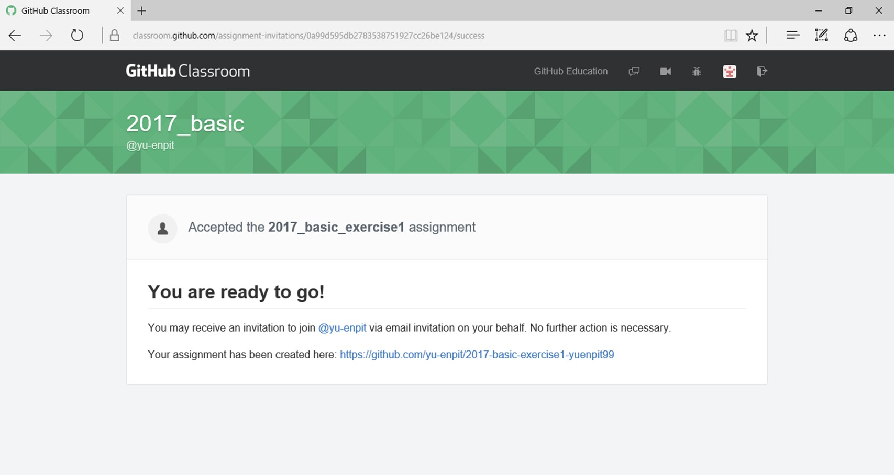

### 2. Fork（フォーク）
1. 「yu-enpit」上に作成されたリポジトリ「課題名-アカウント名」にアクセスします。
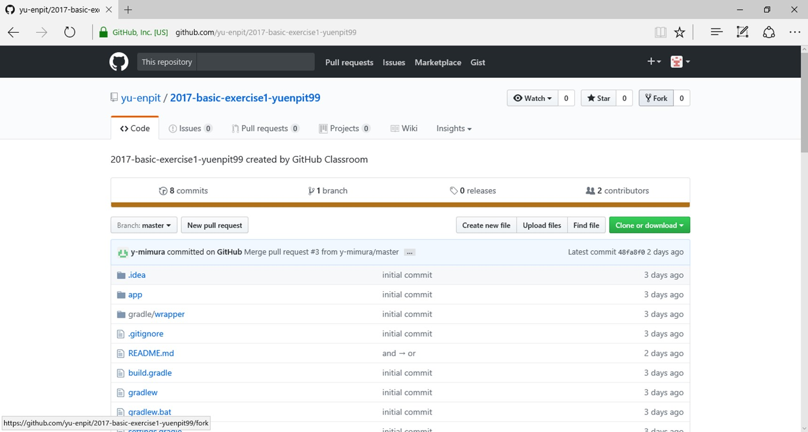
2. 右上の「Fork」ボタンをクリックします。
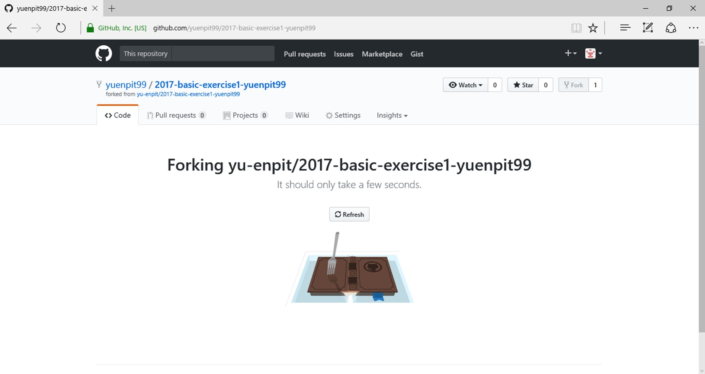
2. 自分のアカウント上に「課題名-アカウント名」のリポジトリが作成されます。
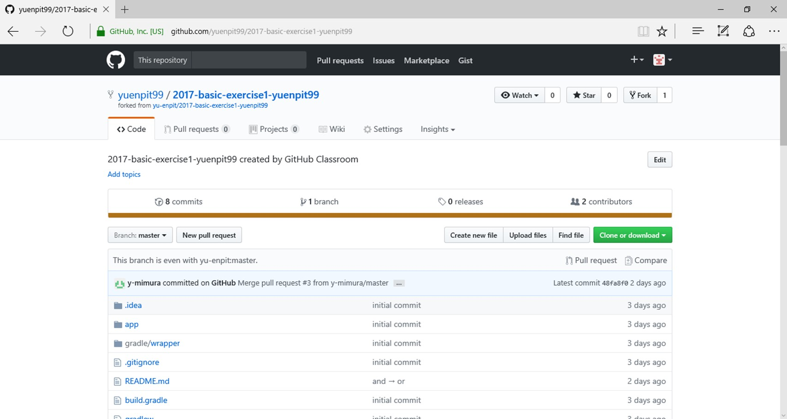

### 3. Clone（クローン）
1. 自分のアカウント上のリポジトリ「課題名-アカウント名」にアクセスします。
2. 「Clone or download」ボタンをクリックします。
3. URLをコピーします。
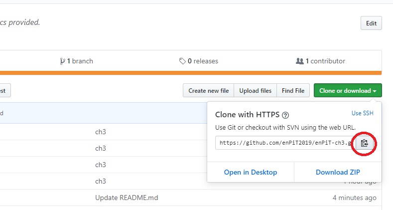
4. Android Studioを起動し、Check out project from Version Control から git を選択します。
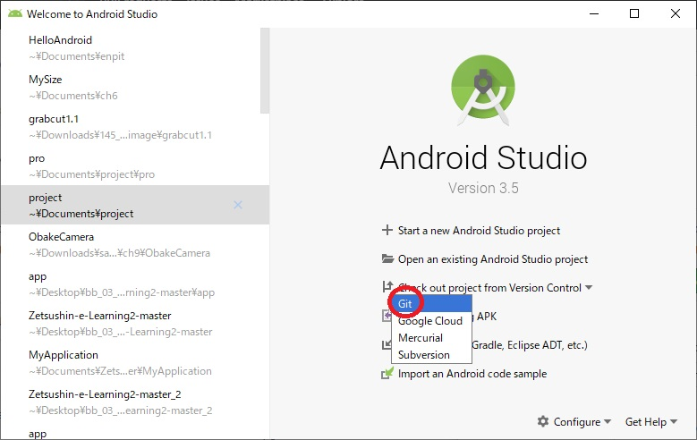
5. URLをペーストしプロジェクトをクローンします。
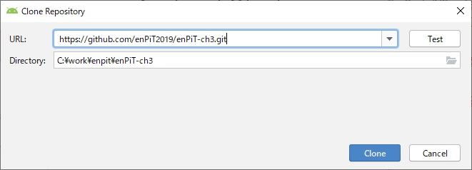

### 4. プログラム修正      
1. 教科書通りにchapter3を進めます。

### 5. Commit（コミット）
1. ツールウィンドウ「Version Control」を表示します。
2. Defaultを右クリック > Commit Changes... をクリックします。
3. Commit Messageにコメント「chapter3提出」を入力し、「Commit」ボタンをクリックします。

### 6. Push（プッシュ）
1. パンくずリストからプロジェクトのルートフォルダ「課題名-アカウント名」を右クリック > Git > Repository > Push をクリックします。
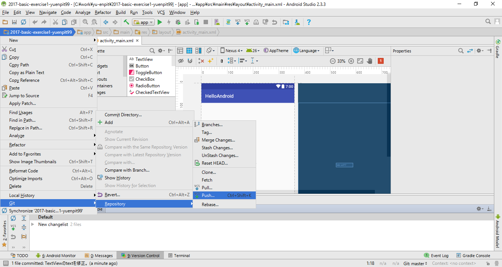
2. 「Push Commits」ウィンドウが表示されます。「Push」ボタンをクリックします。  
  
3. ローカルで行ったプログラム修正が自分のアカウント上のリポジトリ「課題名-アカウント名」に反映されます。

### 7. Pull Request（プルリクエスト）
1. 自分のアカウント上のリポジトリ「課題名-アカウント名」にブラウザからアクセスします。
2. 「New pull request」ボタンをクリックします。
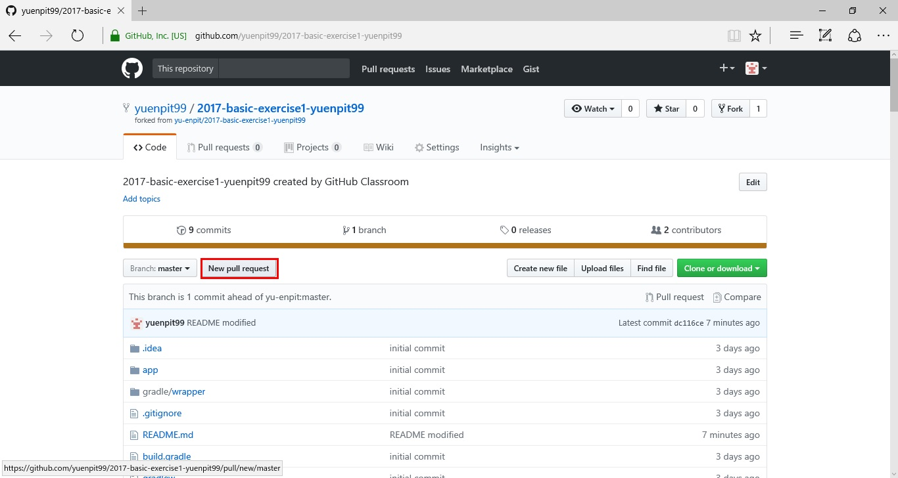
3. 「Comparing changes」画面で変更内容を確認し、「Create pull request」ボタンをクリックします。
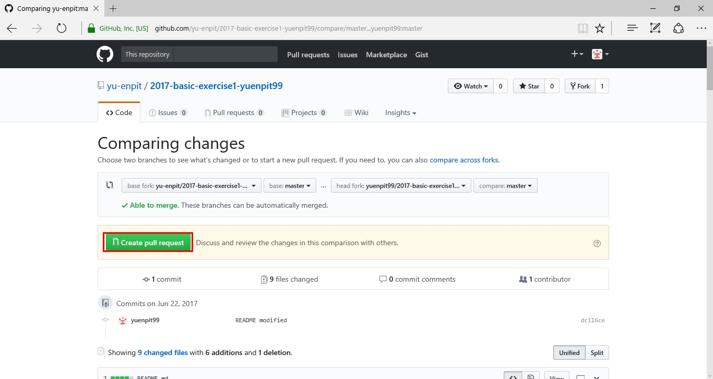
4. コメントを入力し、「Create pull request」ボタンをクリックします。
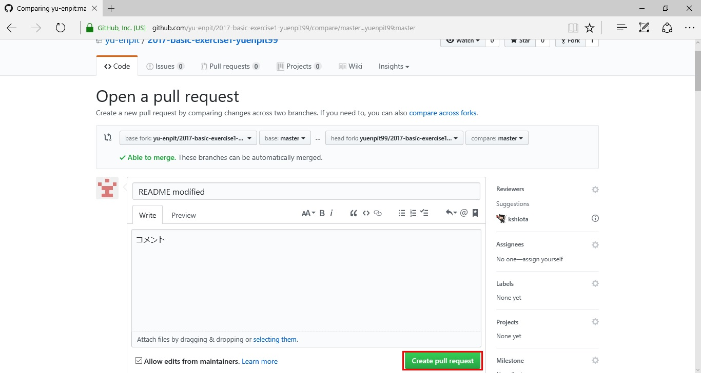
5. 組織アカウント「yu-enpit」上のFork元のリポジトリ「課題名-アカウント名」に Pull Request が送信されます。
